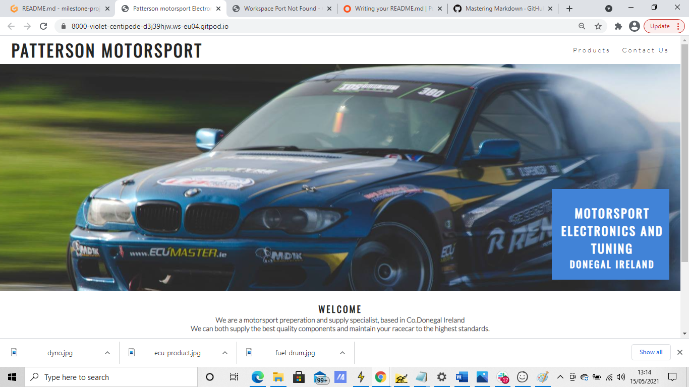
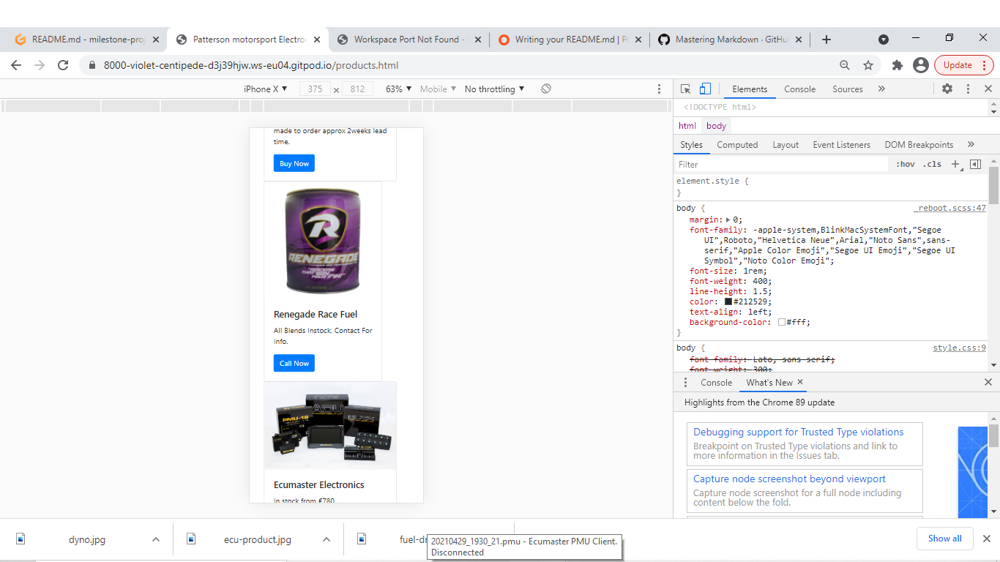

welcome to my milestone project 1
this is a b2b styled website for a motorsport parts company

Format: 

Format: 

the aim of the website is
 to create brand awareness and direct potential customers,
to provide them with contact details and detailed product information

the basic wireframe/style is taken from the love running walkthrough  project along with the animation for main image, 

improvements to be made, 

i will add detailed product info pages focusing on the technical specifications and benefits of each product,
add a gallery of previous tuning and fabrication work completed

i chose to use the photo of a moving car along with the zoom function while the page loads as this animation looks like a moving race car which is something that will catch the target audiance attention.
on the first page i have a basic welcome message, along with links to social media accounts which are already populated with content, this is a short cut rather than creating a gallery of previous work, this is for a later update,

the products page right now has a basic listing along with an action button to bring you to the contact page, this action button will  be changed in an updated version to a 'product info' button which will lead to a dedicated product techical information and pricing page.

responsive design has been incorperated throughout to accomadate mobile users.

i think this website meets my short term goals and has been designed specifically so it can be updated and built upon without changing the layout to the extent it would confuse users who are already comfortable with navigating the site, i have deliberatly set the navigation bar to only display two options at a time and alternate depending on what page you are viewing as this reduces clutter.

credit to:
* my mentor- @Marcel_M_Mentor who went above an beyond to offer assistance and advice on such short notice (we were only paired 2days before submission deadline)
* love running walkthrough project by @AJGreaves for the inspiration for the zoom animation on the index page
* jsdeliver.com for the bootstrap on the products and contacts pages
* fontawesome for the icons for the social media links

